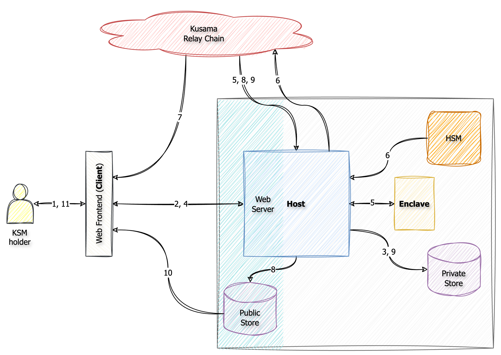

# Glove Technical Design

## Confidential computing overview

There are three components in an enclave-based architecture:

- The enclave
- The host
- The client(s)

The host is the VM/computer/operator within which the enclave is running in. The host has the ability to start and stop
the enclave and also acts as the communication medium between the enclave and its remote clients. This is because
enclaves run in a very restricted environment and typically do not have access to resources such as the network stack 
and disk. Instead they rely on the host to relay messages back and forth.

Depending on the use case the host may be untrusted by the enclave and clients and considered a malicious observer.
In such a scenario the communication between the enclave and the clients must be encrypted end-to-end. This typically 
requires a custom communication channel and rules out TLS, since that would terminate the encryption at the host.
For other use cases, the host observing the communication may not be an issue but it must be prevented from manipulating
or re-ordering messages.

Thus, the enclave can be thought of as a secure isolated environment within a broader untrusted host environment.

The enclave process should be as simple as possible, only performing those tasks that can only be done inside the
enclave environment. Everything else should be offloaded to the host. This reduces the complexity of the enclave code 
and makes it easier to audit, which is a necessary component for establishing trust with the enclave. Less code also 
reduces the surface area for security vulnerabilities inside the enclave.

A key component of an enclave design in remote attestation. This is a document produced by the enclave, signed by the
enclave vendor, which cryptographically proves to the client it’s communicating with a genuine secure enclave. The 
enclave vendor is the root of trust in a confidential computing system.

The client must verify and check the attestation document. Not doing so defeats the entire purpose of having a
confidential computing architecture; not checking the attestation is akin to not having an enclave at all.

## Glove architecture

For Glove, the three components mentioned above would be:

- Enclave - implementing the Glove mixing protocol
- Host - Glove operator running the Glove service and holder of a
  [governance proxy](https://wiki.polkadot.network/docs/learn-proxies#proxy-types) account.
- Client - Substrate-based account, voting on a particular referendum who has delegated to the Glove proxy to anonymise 
  their vote. The client will be represented as a user on the Glove web portal.

The Glove operator is **trusted** to not leak the account holders’ real votes, and so messages between the client and
enclave do not need to be encrypted. This simplifies the design as the encryption from the client can be terminated at
the host and so a standard TLS connection is sufficient.

However, the client still needs assurance the operator is faithfully implementing the Glove protocol and does not 
manipulate voting in anyway. This requires the enclave to produce signed confirmation messages which prove to the 
client (and also to third-parties) the operator implemented Glove correctly ("Glove proofs").

The reference implementation of Glove will use
[AWS Nitro Enclaves](https://docs.aws.amazon.com/enclaves/latest/user/nitro-enclave.html) and this design is based
on that. However the implementation allows other enclave technologies to be added in relatively easily.

### Cryptographic keys

There are several cryptographic keys involved in the Glove process:

- Substrate account key ("client key") - Key of the Substrate-based account that is voting via the Glove 
  proxy. This key is used to [set Glove as a proxy account](https://support.polkadot.network/support/solutions/articles/65000182179-how-to-create-a-proxy-account),
  and also to create the signed voting requests sent to the Glove service. The Glove service accepts all of the 
  [supported signature schemes](https://docs.substrate.io/deploy/keys-and-network-operations/#digital-signature-schemes)
  for accounts.
- Glove proxy account key ("proxy key") - Substrate account key for the Glove goverance proxy. This is owned by the 
  Glove operator. The `sr25519` signature scheme is used.
- Enclave mixer signing key ("enclave mixer key") - For confirming on-chain votes as coming from Glove. This is owned by
  the enclave. The `ed25519` signature scheme is used.
- Enclave image signing key ("enclave image key") - For signing the enclave executable image. This is owned by the 
  Glove operator.
- Enclave vendor attestation key ("attestation key") - For verifying the enclave’s signed attestation document. This is
  owned by the enclave vendor and is well-known.

Both the proxy key and enclave image key are owned by the Glove operator. However, they have different lifecycles and
usage. The proxy key is hot and will be used each time the operator needs to submit votes on-chain, whilst the image key
will only used on the rare occasion to sign a new version of the enclave image. They should thus be stored in separate
locations to reduce the impact of any security breach.

> [!NOTE]
> The enclave image key is optional and is not currently implemented in the reference implementation.

### Components

The Glove architecture consists of the following main components:

#### Web frontend

This is the Glove web portal. It will need access to the client key. It does the following:

- (Optional) Assign Glove as a governance proxy for the client account. This can also be done
  [outside](https://support.polkadot.network/support/solutions/articles/65000182179-how-to-create-a-proxy-account) of 
  the Glove workflow.
- Sign the voting request for a referendum with their client account key. This is to prevent tampering by the host.
- As the client of the enclave, verifies the host has engaged the vote mixer enclave correctly by performing its own 
  checks.

#### Host

This is the Glove operator’s web service which runs the vote mixer enclave. It is a binary running in an EC2 
instance. It has the following responsibilities:

- Expose a REST API for the web frontend, and other clients, to send voting requests to
- Connect to the configured Substrate network to receive updates on who has assigned it as their voting proxy
- Run the vote mixer enclave and submit its voting results back to the Substrate chain
- Listen for any Glove participants who decide to vote directly so that they can be removed from the Glove mixing

#### Enclave

This is the vote mixer enclave which executes the Glove mixing protocol on voting requests it receives from its 
clients via the host. Crucially, it will sign the result of this mixing, producing a Glove proof, which proves to 
the client and others it was involved in on-chain votes produced by the Glove proxy. The enclave binary will run 
inside an AWS Nitro Enclave environment.

#### Private store

Private store for storing votes requests which have not been mixed. AWS DynamoDB is used.

> [!NOTE]
> The reference implementation deletes the requests once the referendum is closed, and so historical requests are 
> not available. This can be easily changed if required.

#### Public store

Public storage of the signed Glove proofs produced by the enclave. The reference implementation stores these as 
`remark`s on the Substrate network itself, though this can be expanded to support any publicly accessible store.

#### HSM

HSM for storing the the Glove proxy’s account key, which will be used by the host.

> [!NOTE]
> The reference implementation does not use an HSM.

### Voting workflow

The following diagram summaries the key steps in the Glove voting process:

1. After assigning the Glove as their voting proxy, the client enters in their voting direction, conviction and 
   amount for a particular referendum on the web frontend (client).
2. The client will generate a random nonce, attach it to the voting request, sign it with the client key, and send 
   both the request and signature to the web server running on the host. The nonce is required to detect replay 
   attacks if multiple voting requests are submitted and so the client is advised to keep this around until the
   referendum closes. The nonce only needs to be unique for the same referendum, and so a counter can also be used.
3. The host will store the signed vote request in the private data store
4. The web server sends back a HTTP `OK` as confirmation the vote request was received. Notice, this does not mean 
   the vote was mixed and submitted onto the chain. The client can update the UI to a "vote acknowledged" state.
5. Before the referendum comes to an end, the host will send all the voting requests for it to the enclave to be 
   mixed. The enclave will performing the mixing process detailed [below](#glove-proof-generation) and produce a 
   Glove proof.
6. The host will submit these instructions as proxied votes to the network, using the Glove proxy account key.
7. The client’s assigned mixed vote will appear on-chain. However, for the client this is not proof the Glove 
   protocol was followed as the host could have submitted its own votes using the proxy key.
8. Once all the votes are confirmed on-chain, the host will persist the Glove proof and attestation document to the 
   public store
9. Once the host is notified the referendum is closed, the voting request is deleted from the private store.
10. The client will download the Glove proof and attestation document and do the following:
    1. Confirm it's latest vote is present by checking the nonce
    2. Make sure the proxy address and referendum ID are as expected
    3. Verify the signature is valid using the enclave mixer key
    4. Verify the mixer key came from a genuine Glove enclave by verifying the attestation (see
       [below](#proof-of-mixing) for details).
11. If the client successfully verifies the proof, it updates the UI and informs the user of the proxied vote.

### Glove proof generation

The host will aim to mix the vote requests for a referendum only once, near its end. Mixing multiple times risks 
leaking the private voting preferences in the requests. Clients will not be able to vote once the host has submitted 
the votes on-chain, though this is unlikely to be an issue since the mixing will be done at the end. The only exception
to this is if the host detects a client also voting on the same referendum outside of the Glove proxy.

When the enclave receives the voting requests for from the host it will:

1. Verify the signature of each request using the client's public key to ensure they’ve not been modified
2. Make sure each request is for the same referendum and Substrate network by checking the genesis block hash
3. Execute the Glove mixing algorithm on them as a single group. The result will be a list of randomized votes for 
   each participant.
4. Create the following data structure and sign it with the mixer key:
  - Referendum ID
  - List containing each randomised vote:
    - Client account
    - Assigned random vote
    - Request nonce

The enclave’s current attestation document is appended to this signed data structure, and together this is called 
the Glove proof.

## Proof of mixing

The fundamental component of the architecture is the enclave mixer key and the signed proofs it produces. The key is 
randomly generated inside the enclave and its private portion never leaves the enclave environment. Verifying the 
enclave’s remote attestation document proves any on-chain vote which also has a matching Glove proof was mixed 
according to the Glove protocol.

The remote attestation document is generated on enclave boot up and has the following relevant components:

- Public portion of the enclave mixer key
- The genesis block hash of the Substrate network
- Enclave code measurement
- Public portion of the enclave image key

All of this is signed by the enclave vendor attestation key. As the enclave vendor is the root of trust, a valid 
signature proves the attestation document came from a real secure enclave.

This does not however prove the enclave is running the Glove protocol. For that one of two checks need to be made:

- The enclave code measurement is a hash of the code the enclave environment is executing. The Glove operator will 
  need open source or make this code publicly available, along with instructions of how to generate this same code 
  measurement. By auditing the code to confirm it’s correctly implementing the Glove protocol, and confirming the 
  generated code measurement is the same as the one in the attestation, proves the attestation document represents a 
  Glove enclave.
- If auditing the code is not possible, the enclave image key in the attestation document can be checked against the 
  key the Glove operator has made public. This proves the attestation came from an enclave built by the Glove 
  operator, but assumes the Glove operator is trusted to implement Glove correctly.

Once it’s confirmed the enclave is running Glove, the final check is to make sure the proxy address in the 
attestation is as expected.

## Failure recovery

The host does not delete the voting requests from the private store until the referendum has closed. If 
at any point the service goes down or is restarted, it can safely recover all the voting requests.

The first thing the host does on startup is load all the voting requests from the private store. Any voting requests 
for referenda which are now closed are deleted from the store, leaving only voting requests for open referenda.

There are several scenarios where the host will need to immediately execute the Glove algorithm for a referendum:

1. The Glove proof for the referendum is not present in the public store, but the conditions for executing the Glove 
   algorithm are now met
2. The Glove proof for the referendum is present but there is a mismatch between the voting requests loaded from the 
   private store and the assigned votes in the proof.

## Threat model

There are several attacks a malicious actor who gains access to the Glove system could perform to undermine Glove, 
in increasing order of severity:

1. Tricking participants into thinking on-chain votes from the Glove proxy were not in accordance to Glove when in 
   fact they were
2. Manipulating the voting requests unnoticed, i.e. Glove participants believing the proxy is functioning correctly. 
   This can broken down further:
   1. Removing voting requests
   2. Replaying old voting requests
   3. Changing voting requests. This thought is not possible as the requests are signed by client.
   4. Adding a new voting request not from a Glove participant. This will always be detected by the Substrate network.
3. Revealing participants’ private voting requests, both for current and past referenda
4. Tricking participants into thinking on-chain votes came from the Glove proxy when in fact they didn’t

Which attacks are possible depend on the components compromised.

### Private store

| Attack | Vulnerability                                                       | Mitigation                                                                  |
|--------|---------------------------------------------------------------------|-----------------------------------------------------------------------------|
| 2i     | Voting requests can be deleted directly from the data store         | Detected by Glove participant as their entry will not be in the Glove proof |
| 3      | No, since data stores such as AWS DynamoDB store all data encrypted |                                                                             |

### Public store

| Attack | Vulnerability                              | Mitigation                 |
|--------|--------------------------------------------|----------------------------|
| 1      | Glove proofs can be deleted from the store | Proofs are stored on-chain |

### HSM

| Attack | Vulnerability                                                                                                     | Mitigation                                                                                                                                                                                                                |
|--------|-------------------------------------------------------------------------------------------------------------------|---------------------------------------------------------------------------------------------------------------------------------------------------------------------------------------------------------------------------|
| 2      | In the unlikely event of a compromise of the proxy account key, arbitrary voting from the proxy account can occur | Detected by all Glove participants as there isn’t a Glove proof. As an extra layer of defensive, AWS KMS has a secure enclave release feature where secret material can only be released to a specific AWS Nitro enclave. |

### Host

| Attack | Vulnerability                                                                                            | Mitigation                                                                                 |
|--------|----------------------------------------------------------------------------------------------------------|--------------------------------------------------------------------------------------------|
| 2i     | Not passing in voting request to the enclave                                                             | Detected by Glove participant as their entry will not be in the Glove proof                |
| 2ii    | Updated voting request can be dropped                                                                    | Detected by Glove participant as their entry in the Glove proof will contain the old nonce |
| 3      | Yes, both from the web server after TLS termination, and from the private store after encryption at rest | Implement end-to-end encryption between the client and enclave                             |
| 4      | No, since the host cannot access the enclave mixer key to forge Glove proofs                             |                                                                                            |

### Enclave

If there is a breach of the enclave then the attacker gets access to the mixer key and is able to forge fake Glove 
proofs. This would only affect open referenda.

### Client

The client may try to disrupt the Glove process for other Glove participants by first voting with Glove and then 
directly. Though the host will be looking for this behaviour, and will kick out the offending client, the malicious 
client might try to do this near the end of the referendum and leave little time for the host to take corrective action.

## Further Improvements

As highlighted above, end-to-end encryption between the client and enclave removes the impact of a security breach 
on the host where the private voting requests could then be leaked. It also has an added benefit of removing the 
need to trust the Glove operator.
